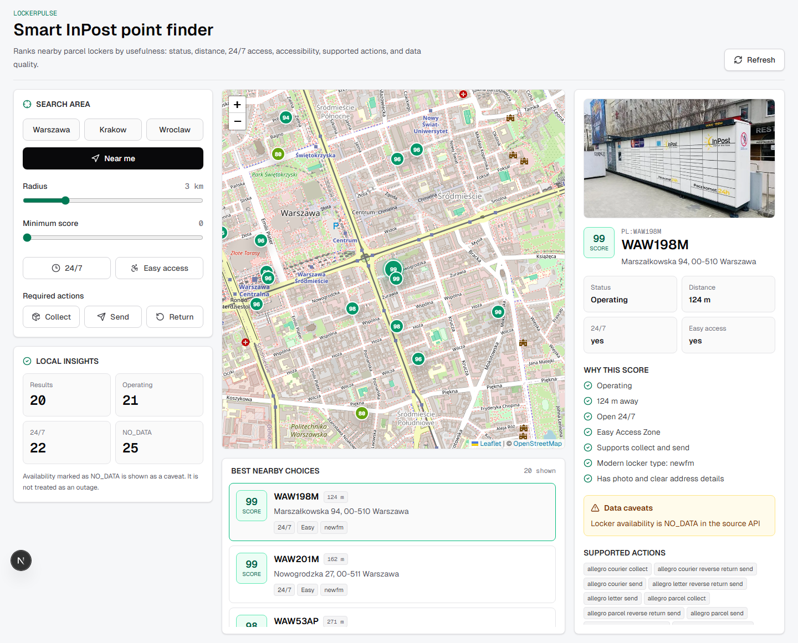

# LockerPulse

LockerPulse is a focused take on the InPost internship assignment: a smart finder that helps users choose the best nearby InPost point, not just the nearest one.

The app queries the live InPost Global Points API, ranks nearby parcel lockers with an explainable score, stores local reliability history, accepts anonymous problem reports, and can optionally triage those reports with a local or cloud model.

## What I built

The core problem I chose:

> When several InPost points are nearby, distance alone is not enough. A better choice also depends on operating status, 24/7 availability, accessibility, supported actions, reliability history, and fresh user reports.

LockerPulse provides:

- nearby search using `relative_point` and `max_distance`,
- address lookup through a backend geocoding endpoint,
- explainable `LockerPulse Score` from 0 to 100,
- a simple customer-facing search flow with adjustable radius,
- ranking list and Leaflet map,
- point details with image, address, score reasons, warnings, and supported functions,
- historical snapshots collected into Postgres,
- reliability labels based on recent status history,
- customer-facing risk alerts and nearby alternatives,
- anonymous user problem reports that influence risk advice,
- provider-agnostic report triage that works with rules only, local models, or cloud models,
- a standalone collector that can run once or in a loop,
- API exploration notes generated from real InPost API responses.

## Tech stack

- Monorepo: npm workspaces
- Frontend: Next.js App Router, TypeScript, Tailwind CSS, SWR, Leaflet
- Backend: FastAPI, Pydantic, httpx, LiteLLM
- Database: Postgres + Prisma Client Python
- Tooling: uv for Python dependencies, Docker Compose for Postgres
- Deployment target: Railway with separate API and web services

## Project structure

```txt
apps/
  api/        FastAPI backend
  web/        Next.js frontend
packages/
  database/   Prisma schema
docs/
  api-exploration.md
  decisions.md
infra/
  compose.yaml
  docker/
    api.Dockerfile
    web.Dockerfile
scripts/
  explore_inpost_api.py
```

## Running locally

Requirements:

- Node.js 20.9+
- npm 10+
- Python 3.10+; Python 3.12 is recommended
- uv
- Docker
- Optional: Ollama with `gemma3:4b` for the local AI triage demo

Install dependencies and create the local env file:

```bash
npm install
uv sync --project apps/api
cp .env.example .env
```

On Windows PowerShell, copy the env file with:

```powershell
Copy-Item .env.example .env
```

Start Postgres, generate Prisma Client Python, and push the current schema:

```bash
docker compose --env-file .env -f infra/compose.yaml up -d
npm run db:generate
npm run db:push
```

If port `5432` is already used locally, set both `POSTGRES_PORT` and the port inside `DATABASE_URL` in `.env` to another value, for example `5433`.

Run the whole app:

```bash
npm run dev
```

Or run services separately:

```bash
npm run dev:api
npm run dev:web
```

Open:

- frontend: [http://localhost:3000](http://localhost:3000)
- customer app: [http://localhost:3000/app](http://localhost:3000/app)
- backend OpenAPI: [http://127.0.0.1:8000/docs](http://127.0.0.1:8000/docs)
- admin reports: [http://localhost:3000/admin](http://localhost:3000/admin)
- reliability demo: [http://localhost:3000/demo-history?demo=true](http://localhost:3000/demo-history?demo=true)

### Report triage modes

The app works without any model. By default `REPORT_TRIAGE_MODEL=""` uses deterministic rules based on report category and comment keywords. This is the recommended production default for the first Railway deploy.

For the local AI demo, install Ollama, make sure the server is running, and pull Gemma 3 4B:

```bash
ollama serve
ollama pull gemma3:4b
ollama list
```

Then set these values in `.env`:

```env
REPORT_TRIAGE_PROVIDER="litellm"
REPORT_TRIAGE_MODEL="ollama_chat/gemma3:4b"
REPORT_TRIAGE_API_BASE="http://127.0.0.1:11434"
```

If Ollama is already running as a background service, `ollama serve` may say the port is already in use. That is fine; verify with `ollama ps` or `ollama list`.

Optional cloud model setup uses LiteLLM model names and provider env vars, for example:

```env
REPORT_TRIAGE_PROVIDER="litellm"
REPORT_TRIAGE_MODEL="openai/gpt-4o-mini"
OPENAI_API_KEY="..."
```

API keys stay on the backend only. They are never stored in the frontend or entered by the user. Photos are not sent to cloud models unless `REPORT_TRIAGE_ALLOW_CLOUD_PHOTOS=true`.

Analyze pending reports manually, for example after changing the triage provider:

```bash
npm run reports:analyze-pending
```

### Collector and demo data

Collect status history once:

```bash
npm run collector:once
```

Run the collector in a 30-minute loop:

```bash
npm run collector:loop
```

Seed demo reliability data for the reviewer:

```bash
npm run demo:history
```

This command creates 10 local example Paczkomats, including `SYZ01M` in Strzyzewice, with seven-day snapshot histories and different reliability cases. These records are marked in the UI as example data and are meant only to demonstrate the `Niezawodnosc` panel without waiting for several real collector runs.

The demo seed also creates a small cluster around `SYZ01M`, so the detail page can show a risky point and better nearby alternatives. It also creates demo user reports and stored triage analyses for `SYZ01M` and `LODFLIP1`, which shows how community signals affect the advice layer and final score.

Demo data is opt-in. The normal app runs with demo mode OFF and uses live InPost API data plus non-demo local history/reports only. Turn on the `Tryb demo` switch in the UI, or add `demo=true` to the URL, to include these local example Paczkomats.

### Local troubleshooting

- Database connection fails: confirm Docker is running and `docker compose --env-file .env -f infra/compose.yaml ps` shows Postgres as healthy.
- Port conflict on Postgres: change `POSTGRES_PORT` and the port in `DATABASE_URL`.
- Frontend cannot reach API: check `NEXT_PUBLIC_API_BASE_URL` and restart `npm run dev:web`; this value is public and read by the browser.
- CORS error in browser: make sure backend `WEB_ORIGIN` matches the frontend URL.
- Admin API returns unauthorized: either leave `ADMIN_TOKEN=""` locally or send `X-Admin-Token`.
- AI analysis does not use Ollama: check `REPORT_TRIAGE_MODEL`, `REPORT_TRIAGE_API_BASE`, `ollama list`, and `ollama ps`.

## Docker

Build the backend image from the repository root:

```bash
docker build -f infra/docker/api.Dockerfile -t lockerpulse-api .
```

Run it with your local `.env`:

```bash
docker run --rm --env-file .env -p 8000:8000 lockerpulse-api
```

Build the frontend image. `NEXT_PUBLIC_API_BASE_URL` is a build-time value for Next.js:

```powershell
docker build -f infra/docker/web.Dockerfile `
  --build-arg NEXT_PUBLIC_API_BASE_URL=http://127.0.0.1:8000 `
  -t lockerpulse-web .
```

On bash:

```bash
docker build -f infra/docker/web.Dockerfile \
  --build-arg NEXT_PUBLIC_API_BASE_URL=http://127.0.0.1:8000 \
  -t lockerpulse-web .
```

Run the frontend:

```bash
docker run --rm -p 3000:3000 lockerpulse-web
```

## Deploying to Railway

Recommended production shape:

- `lockerpulse-api`: FastAPI backend from `infra/docker/api.Dockerfile`
- `lockerpulse-web`: Next.js frontend from `infra/docker/web.Dockerfile`
- Railway PostgreSQL: database service with `DATABASE_URL` referenced by the API

Create the project from GitHub in Railway, add PostgreSQL, then create two app services from the same repository. In each service, set a custom Dockerfile path:

```env
# API service
RAILWAY_DOCKERFILE_PATH="infra/docker/api.Dockerfile"

# Web service
RAILWAY_DOCKERFILE_PATH="infra/docker/web.Dockerfile"
```

API service variables:

```env
DATABASE_URL="${{Postgres.DATABASE_URL}}"
WEB_ORIGIN="https://<web-domain>"
RUN_DB_PUSH_ON_START="true"
INPOST_API_BASE_URL="https://api-global-points.easypack24.net/v1"
INPOST_REQUEST_TIMEOUT_SECONDS="10"
NOMINATIM_API_BASE_URL="https://nominatim.openstreetmap.org"
REPORT_TRIAGE_PROVIDER="auto"
REPORT_TRIAGE_MODEL=""
REPORT_TRIAGE_API_BASE=""
REPORT_TRIAGE_ALLOW_CLOUD_PHOTOS="false"
ADMIN_TOKEN="<strong-random-token>"
```

Web service variables:

```env
NEXT_PUBLIC_API_BASE_URL="https://<api-domain>"
```

After Railway generates the web domain, update `WEB_ORIGIN` on the API service. After Railway generates the API domain, update `NEXT_PUBLIC_API_BASE_URL` on the web service and redeploy the web service because `NEXT_PUBLIC_*` values are baked into the Next.js build.

For this small recruitment project, the API Docker image can push the Prisma schema at startup when `RUN_DB_PUSH_ON_START=true`. If you prefer Railway's dedicated pre-deploy step instead, leave that variable false and set this API pre-deploy command:

```bash
uv run --project apps/api prisma db push --schema packages/database/prisma/schema.prisma
```

The production deploy does not need Ollama. Report triage runs with deterministic rules unless you explicitly configure a LiteLLM provider and backend-only API key.

Useful Railway CLI commands:

```bash
railway login
railway whoami
railway link
railway status
railway logs
```

If `railway` is not in PATH, use:

```bash
npx railway login
npx railway whoami
npx railway link
npx railway status
npx railway logs
```

Railway references used for this setup:

- Monorepo services: [Railway monorepo deployments](https://docs.railway.com/deployments/monorepo)
- Custom Dockerfile path: [Railway Dockerfiles](https://docs.railway.com/builds/dockerfiles)
- Runtime port: [Railway public networking](https://docs.railway.com/public-networking)
- Postgres `DATABASE_URL`: [Railway PostgreSQL](https://docs.railway.com/databases/postgresql)
- Next.js public env vars: [Railway frontend environment variables](https://docs.railway.com/guides/frontend-environment-variables)

## API examples

Geocode an address:

```bash
curl "http://127.0.0.1:8000/api/v1/geocode?q=Dluga%201,%20Gdansk"
```

Search nearby points using coordinates returned by geocoding:

```bash
curl "http://127.0.0.1:8000/api/v1/points/search?lat=52.2297&lng=21.0122&radius_m=3000&functions=parcel_collect,parcel_send"
```

The response includes `score`, `grade`, `reasons`, and `warnings` for every point.

Get recent point history:

```bash
curl "http://127.0.0.1:8000/api/v1/points/PL/GDA65M/history?days=7"
```

Use demo data explicitly:

```bash
curl "http://127.0.0.1:8000/api/v1/points/PL/SYZ01M/history?days=7&demo=true"
```

Get safer alternatives for a selected point:

```bash
curl "http://127.0.0.1:8000/api/v1/points/PL/SYZ01M/alternatives?lat=51.0808&lng=22.4416&radius_m=3000"
```

Submit an anonymous problem report:

```bash
curl -X POST "http://127.0.0.1:8000/api/v1/points/PL/SYZ01M/reports" \
  -H "Content-Type: application/json" \
  -d "{\"reason\":\"screen_problem\",\"comment\":\"Ekran nie reaguje na dotyk przez kilka prob.\"}"
```

The UI can attach up to 3 optional photos to a report. Locally they are stored as small image data URLs in Postgres JSON, which keeps the internship demo self-contained without adding object storage.

Inspect stored triage analysis for a report:

```bash
curl "http://127.0.0.1:8000/api/v1/reports/<report_id>/analysis"
```

List and delete reports from the simple admin API:

```bash
curl "http://127.0.0.1:8000/api/v1/admin/reports?include_demo=true"
curl -X DELETE "http://127.0.0.1:8000/api/v1/admin/reports/<report_id>"
```

If `ADMIN_TOKEN` is set in `.env`, admin requests must include `X-Admin-Token`.

## Scoring model

The first version is intentionally simple and explainable:

- 35 points: `status` is `Operating`
- 20 points: distance within the selected radius
- 15 points: open 24/7
- 10 points: Easy Access Zone
- 10 points: required functions are supported
- 5 points: modern physical type such as `next`, `newfm`, or `modular`
- 5 points: public details are complete enough to trust the listing

`locker_availability=NO_DATA` is shown as a warning, not as a failure. In early API exploration this field often returned `NO_DATA`, so treating it as an outage would create misleading recommendations.

When history exists, the score can also receive a small reliability adjustment:

- stable recent history can add a small bonus,
- frequent changes or a recent non-operating status lower the score,
- no history is neutral and never penalizes a point.

Stage 4 adds a customer-facing risk label on top of the score. It classifies a point as `ok`, `watch`, `risky`, or `critical`, then uses that label to show a simple alert and recommend better nearby alternatives when useful.

Stage 5 adds a community signal. Fresh user reports can raise the risk label and strengthen the Plan B recommendation, but they do not change the official InPost status.

Stage 6/7 replaces the raw report-count penalty with saved report triage:

- each report is analyzed once, either by deterministic rules or a configured LiteLLM model,
- the analysis is stored in `UserReportAnalysis`,
- search and detail pages only read stored analysis results,
- if no model is configured, rules still produce severity, risk floor, and score penalty,
- if the configured model fails, the backend stores a rules fallback result instead of blocking the report,
- low-confidence or spam-like reports do not reduce the score,
- useful reports receive a saved severity, confidence, risk floor, and score penalty.

The final score is:

```txt
final_score = base_score_after_history - community_penalty_from_stored_triage_analyses
```

Only analyses from the last 24 hours affect the current score. The analysis of a single report stays immutable; the score naturally recovers when old reports leave the 24-hour window.

## Data caveats

This stage does not claim to know actual locker occupancy. The app uses the live API snapshot plus collected status history and exposes uncertainty when the source data is incomplete.
User reports and triage are anonymous helper signals, not official InPost operational data. A model, when configured, never changes the official InPost status; it only estimates the risk of a user-reported problem.

Still out of scope:

- occupancy prediction,
- user subscriptions,
- PDF reports,
- full Europe-wide crawling by default,
- regional monitoring,
- alert notifications.

The collector starts with a small watchlist of city centers so the project demonstrates history without aggressively crawling the full InPost network.

## API exploration

Run:

```bash
npm run explore:api
```

This writes `docs/api-exploration.md` using live API data.

## Testing

Backend tests:

```bash
uv run --project apps/api pytest
```

Full project check:

```bash
npm test
```

## Screenshots


